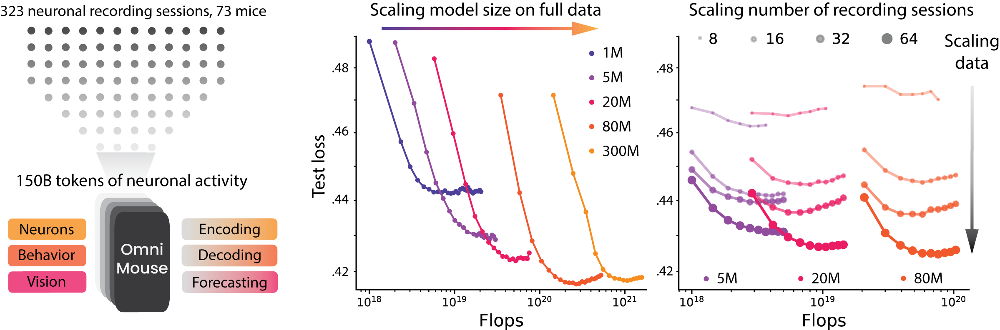

# OmniMouse

**Scaling properties of multi-modal, multi-task Brain Models on 150B Neural Tokens**

[](https://arxiv.org/abs/2604.18827)
[](https://openreview.net/forum?id=mEw4lhAn0F)
[](https://enigma-brain.github.io/omnimouse/)
[](https://huggingface.co/the-enigma-project/omnimouse-80M)
[](https://huggingface.co/datasets/the-enigma-project/omnimouse-dataset)
[](https://enigma-brain.github.io/omnimouse-data-release/)
[](LICENSE)

<p align="center">
  
</p>

<p align="center"><em>
OmniMouse unifies neural prediction, behavior decoding, and forecasting in a single multi-modal, multi-task transformer.
Trained on 150B+ neural tokens from the mouse visual cortex, OmniMouse achieves state-of-the-art performance across virtually every task.
Scaling model size on the full corpus saturates around 80M parameters; scaling data, in contrast, continues to improve performance across every model size &mdash; brain models remain data-limited.
</em></p>

## Abstract

Scaling data and models has transformed AI. Does the same hold for brain modeling? We train multi-modal, multi-task models on 3.1 million neurons from 73 mice (150B+ neural tokens), flexibly supporting neural prediction, behavioral decoding, and neural forecasting. OmniMouse achieves state-of-the-art performance, outperforming specialized baselines across virtually all regimes. Yet performance scales with more data while gains from larger models saturate — inverting the standard AI scaling story: brain models remain data-limited even with vast recordings.

**Authors:** Konstantin F. Willeke\*, Polina Turishcheva\*, Alex Gilbert\*, Goirik Chakrabarty, Hasan A. Bedel, Paul G. Fahey, Yongrong Qiu, Marissa A. Weis, Michaela Vystrčilová, Taliah Muhammad, Lydia Ntanavara, Rachel E. Froebe, Kayla Ponder, Zheng Huan Tan, Emin Orhan, Erick Cobos, Sophia Sanborn, Katrin Franke, Fabian H. Sinz†, Alexander S. Ecker†, Andreas S. Tolias† — Stanford University, University of Göttingen, and collaborators. See the [paper](https://arxiv.org/abs/2604.18827) for full affiliations.

## News

- **2026-04-23** — Public release: code, pretrained models, and [project page](https://enigma-brain.github.io/omnimouse/) live. Dataset available on [🤗 Hub](https://huggingface.co/datasets/the-enigma-project/omnimouse-dataset).
- **2026-01-26** — OmniMouse accepted to **ICLR 2026**.

## Roadmap

Rolling checklist of what's released and what's still landing. PRs welcome.

- [x] Release training and evaluation code
- [x] Release OmniMouse-1M / 5M / 20M / 80M pretrained weights
- [x] Release OmniMouse dataset on 🤗 Hub
- [x] Project page and interactive viewers
- [ ] Upload OmniMouse-300M weights to 🤗 Hub
- [ ] End-to-end training notebook using the released dataset

## Pretrained Models

Checkpoints are hosted on the 🤗 Hub under [the-enigma-project](https://huggingface.co/the-enigma-project), one repo per scale.
Scores are single-trial Pearson correlation on the held-out test set, using the full 323-session training corpus. See the [paper](https://arxiv.org/abs/2604.18827) and [project page](https://enigma-brain.github.io/omnimouse/) for data-matched comparisons and details.

| Model | Params | Forecast | Forecast + Stim | Population | Pop. + Stim | Gaze | Pupil | Running |
| :---- | :----: | :------: | :-------------: | :--------: | :---------: | :--: | :---: | :-----: |
| [OmniMouse-1M](https://huggingface.co/the-enigma-project/omnimouse-1M)     |   1M  | 0.18 | 0.31 | 0.27 | 0.35 | 0.75 | 0.73 | 0.55 |
| [OmniMouse-5M](https://huggingface.co/the-enigma-project/omnimouse-5M)     |   5M  | 0.22 | 0.32 | 0.28 | 0.35 | 0.76 | 0.74 | 0.57 |
| [OmniMouse-20M](https://huggingface.co/the-enigma-project/omnimouse-20M)   |  20M  | 0.23 | 0.33 | 0.29 | **0.37** | 0.78 | 0.75 | 0.73 |
| [OmniMouse-80M](https://huggingface.co/the-enigma-project/omnimouse-80M)   |  80M  | **0.25** | **0.34** | 0.29 | **0.37** | **0.80** | **0.76** | **0.75** |
| [OmniMouse-300M](https://huggingface.co/the-enigma-project/omnimouse-300M) | 300M  | **0.25** | **0.34** | **0.30** | **0.37** | **0.80** | **0.76** | 0.73 |

**Takeaway.** Performance improves up to ~80M parameters and then plateaus on neural prediction tasks. Behavioral decoding continues to scale. At every model size, adding more sessions improves every task — see Figure 7 in the [project page](https://enigma-brain.github.io/omnimouse/).

## Quick Start

Each repo stores the checkpoint as per-rank shards (`rank_*.ckpt`) written by [`omnimouse.utils.ModelCheckpoint`](omnimouse/utils/model_checkpoint.py). Download them and point the standard `eval` entrypoint at the local cache path:

```python
from huggingface_hub import snapshot_download

ckpt_dir = snapshot_download(
    repo_id="the-enigma-project/omnimouse-80M",  # or -1M / -5M / -20M / -300M
    allow_patterns=["rank_*.ckpt"],
)
```

```bash
uv run eval experiment=omnimouse_80M ckpt_path=<ckpt_dir>
```

For a full end-to-end example — loading data, building a masking configuration, loading the checkpoint into a single-rank model, and visualizing predictions — see [`notebooks/inference.ipynb`](notebooks/inference.ipynb).

## Installation

Python **≥ 3.12** is required. We recommend [`uv`](https://docs.astral.sh/uv/):

```bash
git clone https://github.com/enigma-brain/omnimouse.git
cd omnimouse
uv sync
```

Or with pip:

```bash
pip install -e .
```

The dataloader depends on [`experanto`](https://github.com/sensorium-competition/experanto), which is installed automatically from the pinned git revision in `pyproject.toml`.

For containerised environments (Docker, Apptainer/Singularity on HPC), see [`docs/INSTALL.md`](docs/INSTALL.md).

## Data Preparation

OmniMouse trains on the [OmniMouse Dataset](https://huggingface.co/datasets/the-enigma-project/omnimouse-dataset) — 3.1M segmented neurons from 73 mice across 323 sessions of wide-field two-photon calcium imaging, paired with video stimuli and behavioral variables (pupil x/y, pupil size + derivative, running speed). Sessions are distributed as per-experiment `.tar` archives under `experiments/` on the Hub.

The dataset is gated. Request access on the Hub, then export a token with read permission:

```bash
export HF_TOKEN=<your-huggingface-token>
```

The dataset repo ships a [`download_dataset.py`](https://huggingface.co/datasets/the-enigma-project/omnimouse-dataset/blob/main/download_dataset.py) helper that downloads tar archives and extracts them in place. Its default `--download-dir` is `data/`, which matches `paths.data_dir` in [`configs/paths/default.yaml`](configs/paths/default.yaml) (`${PROJECT_ROOT}/data`), so running it from the repo root needs no path overrides:

```bash
# grab the helper script
huggingface-cli download the-enigma-project/omnimouse-dataset download_dataset.py \
  --repo-type dataset --local-dir .

# download + extract every session into ./data
python download_dataset.py --download-all

# …or a smoke-test subset (N random sessions, or named ones)
python download_dataset.py --num-files 4
python download_dataset.py --experiments dynamic17797-4-7-Video-021a75e56847d574b9acbcc06c675055_30hz
```

For a minimal single-file pull without the helper, see the `hf_hub_download` + `tarfile.extractall` snippet in the [dataset README](https://huggingface.co/datasets/the-enigma-project/omnimouse-dataset).

Configs expect extracted session folders directly under `${PROJECT_ROOT}/data/`. Override with `paths.data_dir=<your-path>` on any `train`/`eval` command.

See the [data release blog](https://enigma-brain.github.io/omnimouse-data-release/) for details on acquisition, preprocessing, and structure.

## Training

Training is orchestrated by [Hydra](https://hydra.cc/) configs in [`configs/`](configs/).

**Pretrain OmniMouse-80M** (the headline model) on the full 323-session corpus:

```bash
uv run train experiment=omnimouse_80M
```

The other four sizes are drop-in replacements:

```bash
uv run train experiment=omnimouse_1M     # or 5M, 20M, 300M
```

**Debug / smoke test** on a single session:

```bash
TORCH_LOGS="recompiles" HYDRA_FULL_ERROR=1 uv run train debug=experanto_mtm
```

See [`configs/experiment/`](configs/experiment/) for all preset experiments and [`configs/model/`](configs/model/) for the architecture configs.

## Evaluation

Evaluate a checkpoint on the held-out test set:

```bash
uv run eval \
  experiment=omnimouse_80M \
  ckpt_path=<path-to-checkpoint.pth> \
  linked_experiment_name=<experiment-name-of-checkpoint> \
  linked_run_name=<run-name-of-checkpoint>
```

The `linked_*` parameters track checkpoint provenance for loggers without native artifact linkage. Find their values in the checkpoint's `config_tree.log`.

**Reproducing SENSORIUM benchmarks:** see [`configs/experiment/sensorium_probe/`](configs/experiment/sensorium_probe/).

## Repository Layout

```
omnimouse/
├── omnimouse/              # Source package
│   ├── modeling/           # Model components (MMTM, Hiera encoder, attention, masking embeddings)
│   ├── masking/            # Masking strategies for multi-task training
│   ├── experiments/        # Dataloaders and experiment glue
│   ├── distributed/        # Distributed training utilities
│   ├── entrypoints/        # train / eval / summarize CLIs
│   └── tasks/              # Task configs (MTM, multimodal)
├── configs/                # Hydra configs (experiment, model, data, trainer, ...)
├── notebooks/              # inference.ipynb and exploration notebooks
├── assets/                 # Figures, interactive HTML visualizers
└── hydra_plugins/          # Custom Hydra plugins
```

## Citation

If you find OmniMouse useful in your research, please cite:

```bibtex
@inproceedings{willeke2026omnimouse,
  title     = {OmniMouse: Scaling properties of multi-modal, multi-task Brain Models on 150B Neural Tokens},
  author    = {Konstantin Friedrich Willeke and Polina Turishcheva and Alex Gilbert and Goirik Chakrabarty and Hasan Atakan Bedel and Paul G. Fahey and Yongrong Qiu and Marissa A. Weis and Michaela Vystr{\v{c}}ilov{\'a} and Taliah Muhammad and Lydia Ntanavara and Rachel E Froebe and Kayla Ponder and Zheng Huan Tan and Emin Orhan and Erick Cobos and Sophia Sanborn and Katrin Franke and Fabian H. Sinz and Alexander S. Ecker and Andreas S. Tolias},
  booktitle = {The Fourteenth International Conference on Learning Representations},
  year      = {2026},
  url       = {https://openreview.net/forum?id=mEw4lhAn0F}
}
```

## License

See [LICENSE](LICENSE).

## Acknowledgments

OmniMouse builds on the [experanto](https://github.com/sensorium-competition/experanto) data pipeline, the [Hiera](https://github.com/facebookresearch/hiera) vision transformer, and the [POYO](https://github.com/neuro-galaxy/poyo) Perceiver-style architecture. We thank the SENSORIUM community for the benchmarks that anchor this work.
